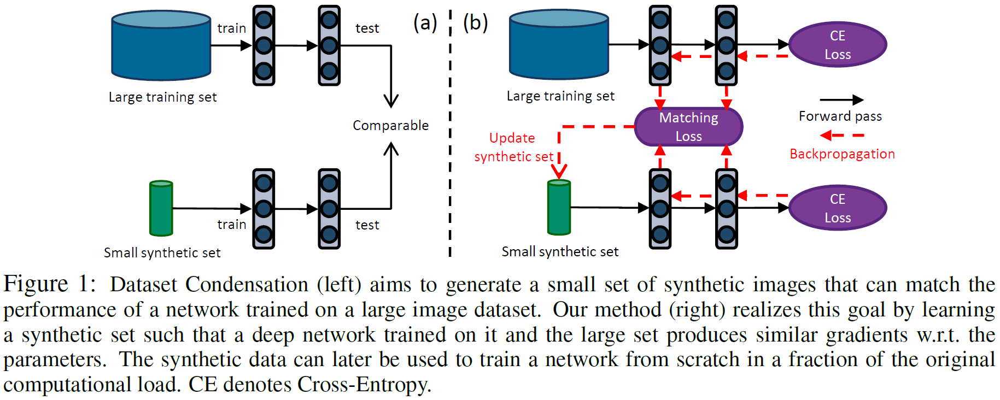
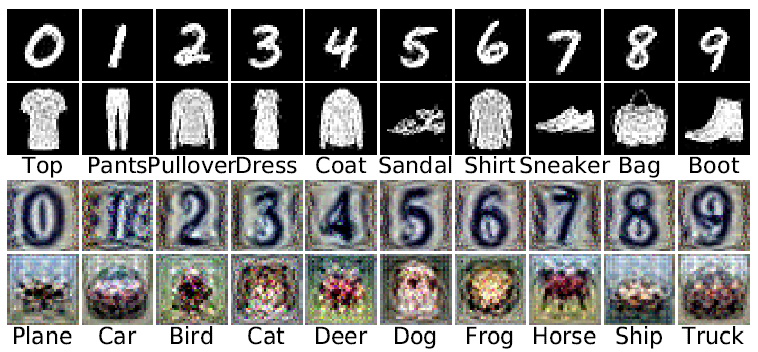
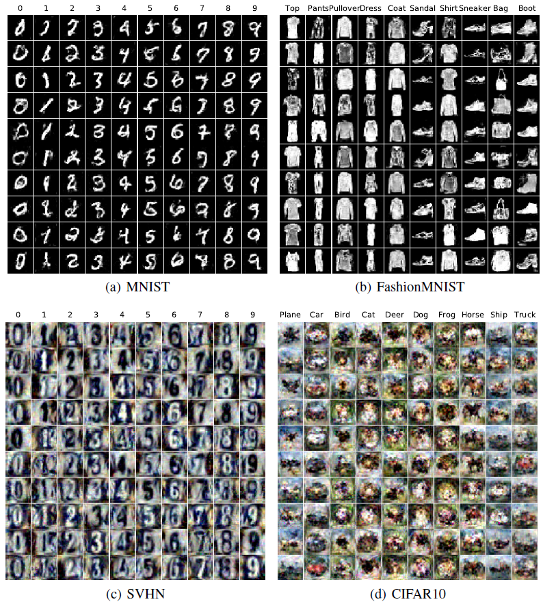
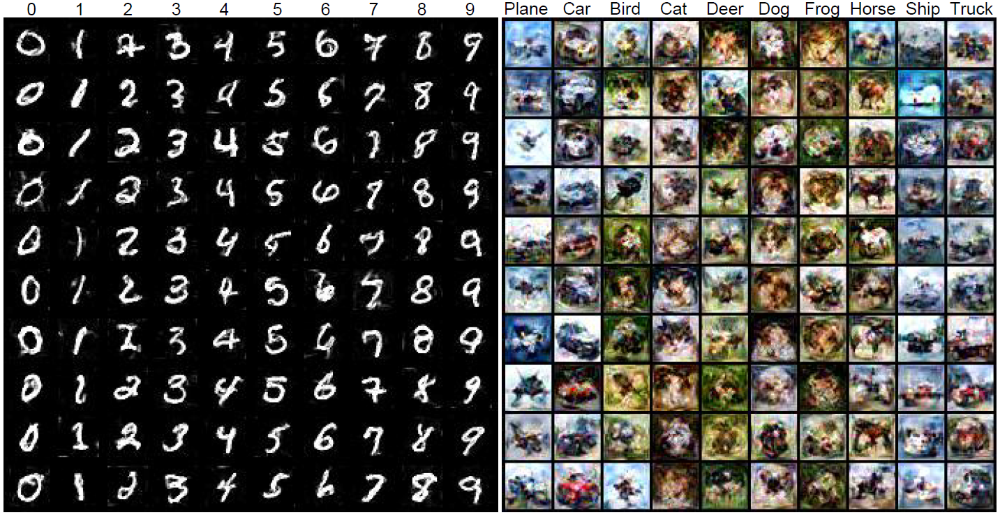
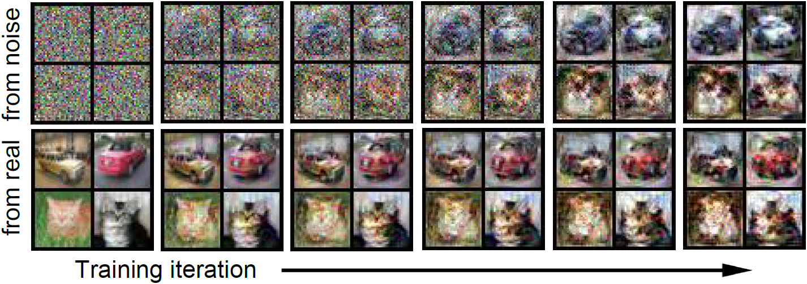
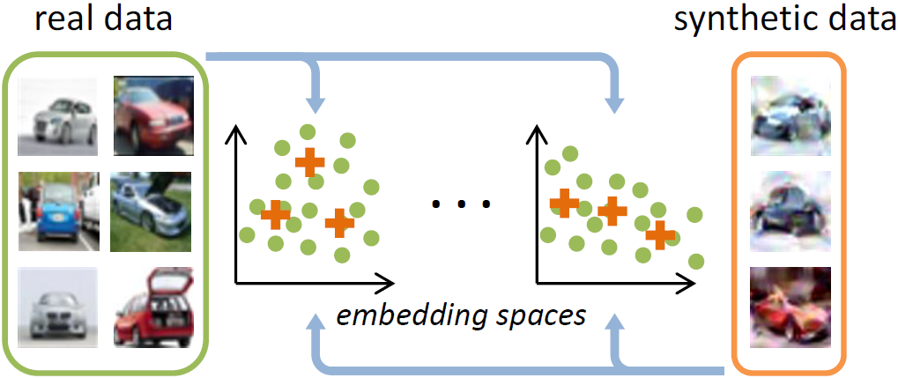
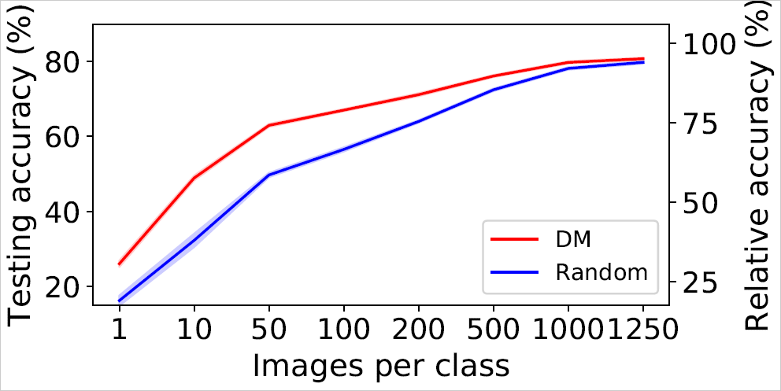

# Dataset Condensation
Dataset condensation aims to condense a large training set T into a small synthetic set S such that the model trained on the small synthetic set can obtain comparable testing performance to that trained on the large training set.

This repository includes codes for *Dataset Condensation with Gradient Matching* (ICLR 2021 Oral), *Dataset Condensation with Differentiable Siamese Augmentation* (ICML 2021) and *Dataset Condensation with Distribution Matching* (arXiv 2021).

Off-the-shelf synthetic sets can be downloaded from [Google Drive](https://drive.google.com/drive/folders/1Dp6V6RvhJQPsB-2uZCwdlHXf1iJ9Wb_g?usp=sharing). Each *.pt* file includes 5 synthetic sets learned with ConvNet in 5 independent experiments and corresponding 100 testing accuracies. Note that these synthetic data *have been* normalized.

## Dataset Condensation with Gradient Matching [[PDF]](https://openreview.net/pdf?id=mSAKhLYLSsl)


### Method
<p align="center"></p>
<center>Figure 1: Dataset Condensation (left) aims to generate a small set of synthetic images that can match the performance of a network trained on a large image dataset. Our method (right) realizes this goal by learning a synthetic set such that a deep network trained on it and the large set produces similar gradients w.r.t. the parameters. The synthetic data can later be used to train a network from scratch in a fraction of the original computational load. CE denotes Cross-Entropy. </center><br>

### Setup
install packages in the requirements.

###  Basic experiments - Table 1
```
python main.py  --dataset CIFAR10  --model ConvNet  --ipc 10
# --dataset: MNIST, FashionMNIST, SVHN, CIFAR10, CIFAR100
# --ipc (images/class): 1, 10, 20, 30, 40, 50
```

### Cross-architecture experiments - Table 2
```
python main.py  --dataset MNIST  --model ConvNet  --ipc 1  --eval_mode M
# --model: MLP, LeNet, ConvNet, AlexNet, VGG11BN, ResNet18BN_AP, Note: set --lr_img 0.01 when --model MLP
```

### Ablation study on different modules - Table T2, T3, T4, T5, T6, T7
```
python main.py  --dataset MNIST  --model ConvNetW32  --eval_mode W  --ipc 1 
python main.py  --dataset MNIST  --model ConvNetW64  --eval_mode W  --ipc 1
python main.py  --dataset MNIST  --model ConvNetW128  --eval_mode W  --ipc 1
python main.py  --dataset MNIST  --model ConvNetW256  --eval_mode W  --ipc 1

python main.py  --dataset MNIST  --model ConvNetD1  --eval_mode D  --ipc 1
python main.py  --dataset MNIST  --model ConvNetD2  --eval_mode D  --ipc 1
python main.py  --dataset MNIST  --model ConvNetD3  --eval_mode D  --ipc 1
python main.py  --dataset MNIST  --model ConvNetD4  --eval_mode D  --ipc 1

python main.py  --dataset MNIST  --model ConvNetAS  --eval_mode A  --ipc 1
python main.py  --dataset MNIST  --model ConvNetAR  --eval_mode A  --ipc 1
python main.py  --dataset MNIST  --model ConvNetAL  --eval_mode A  --ipc 1

python main.py  --dataset MNIST  --model ConvNetNP  --eval_mode P  --ipc 1
python main.py  --dataset MNIST  --model ConvNetMP  --eval_mode P  --ipc 1 
python main.py  --dataset MNIST  --model ConvNetAP  --eval_mode P  --ipc 1

python main.py  --dataset MNIST  --model ConvNetNN  --eval_mode N  --ipc 1
python main.py  --dataset MNIST  --model ConvNetBN  --eval_mode N  --ipc 1 
python main.py  --dataset MNIST  --model ConvNetLN  --eval_mode N  --ipc 1
python main.py  --dataset MNIST  --model ConvNetIN  --eval_mode N  --ipc 1
python main.py  --dataset MNIST  --model ConvNetGN  --eval_mode N  --ipc 1


python main.py  --dataset MNIST  --model ConvNet  --ipc 1  --dis_metric mse
# --dis_metric (gradient distance metrics): ours, mse, cos
# --model: MLP, LeNet, ConvNet, AlexNet, VGG11BN, ResNet18BN_AP
```


### Performance
|  | MNIST | FashionMNIST | SVHN | CIFAR10 | CIFAR100 |
 :-: | :-: | :-: | :-: | :-: | :-:
| 1 img/cls  | 91.7 | 70.5 | 31.2 | 28.3 | 12.8 |
| 10 img/cls | 97.4 | 82.3 | 76.1 | 44.9 | 25.2 |
| 50 img/cls | 98.8 | 83.6 | 82.3 | 53.9 | - |

Table 1: Testing accuracies (%) of ConvNets trained from scratch on 1, 10 or 50 synthetic image(s)/class. Note that the performances are achieved with defult hyper-parameters. Better results can be obtained, if more hyper-parameters are tried.


### Visualization
<p align="center"></p>
<center>Figure 2: Visualization of condensed 1 image/class with ConvNet for MNIST, FashionMNIST, SVHN and CIFAR10. Average testing accuracies on randomly initialized ConvNets are 91.7%, 70.5%, 31.2% and 28.3% respectively. </center><br>


<p align="center"></p>
<center>Figure 3: Visualization of condensed 10 images/class with ConvNet for MNIST, FashionMNIST, SVHN and CIFAR10. Average testing accuracies on randomly initialized ConvNets are 97.4%, 82.3%, 76.1% and 44.9% respectively. </center><br>


### Citation
```
@inproceedings{
zhao2021DC,
title={Dataset Condensation with Gradient Matching},
author={Bo Zhao and Konda Reddy Mopuri and Hakan Bilen},
booktitle={International Conference on Learning Representations},
year={2021},
url={https://openreview.net/forum?id=mSAKhLYLSsl}
}
```


## Dataset Condensation with Differentiable Siamese Augmentation [[PDF]](http://proceedings.mlr.press/v139/zhao21a/zhao21a.pdf)
### Method
<p align="center"></p>
<center>Figure 4: Differentiable Siamese augmentation (DSA) applies the same parametric augmentation (e.g. rotation) to all data points in the sampled real and synthetic batches in a training iteration. The gradients of network parameters w.r.t. the sampled real and synthetic batches are matched for updating the synthetic images. A DSA example is given that rotation with the same degree is applied to the sampled real and synthetic batches. </center><br>


### Setup
install packages in the requirements.


###  Basic experiments - Table 1 & 2
```
python main.py  --dataset CIFAR10  --model ConvNet  --ipc 10  --init real  --method DSA  --dsa_strategy color_crop_cutout_flip_scale_rotate
# --dataset: MNIST, FashionMNIST, SVHN, CIFAR10, CIFAR100
# --ipc (images/class): 1, 10, 20, 30, 40, 50
# note: use color_crop_cutout_flip_scale_rotate for FashionMNIST CIFAR10/100, and color_crop_cutout_scale_rotate for the digit datasets (MNIST and SVHN), as flip augmentation is not good for digit datasets.
```


### Ablation study on augmentation strategies - Table 4
```
python main.py  --dataset CIFAR10  --model ConvNet  --ipc 10  --init real  --method DSA  --dsa_strategy crop
# --dataset: MNIST, FashionMNIST, SVHN, CIFAR10
# --dsa_strategy: color, crop, cutout, flip, scale, rotate, color_crop_cutout_scale_rotate, color_crop_cutout_flip_scale_rotate
# note: flip augmentation is not good for digit datasets (MNIST and SVHN).
```

### Performance
|  | MNIST | FashionMNIST | SVHN | CIFAR10 | CIFAR100 |
 :-: | :-: | :-: | :-: | :-: | :-:
| 1 img/cls  | 88.7 | 70.6 | 27.5 | 28.8 | 13.9 |
| 10 img/cls | 97.8 | 84.6 | 79.2 | 52.1 | 32.3 |
| 50 img/cls | 99.2 | 88.7 | 84.4 | 60.6 | - |

Table 2: Testing accuracies (%) of ConvNets trained from scratch on 1, 10 or 50 synthetic image(s)/class. Note that the performances are achieved with defult hyper-parameters. Better results can be obtained, if more hyper-parameters are tried.


### Visualization
<p align="center"></p>
<center>Figure 5: Visualization of the generated 10 images/class synthetic sets of MINIST and CIFAR10. Average testing accuracies on randomly initialized ConvNets are 97.8% and 52.1% respectively. </center><br>


### Initialization
<p align="center"></p>
<center>Figure 6: The learning/rendering process of two classes in CIFAR10 initialized from random noise and real images respectively. </center><br>


### Citation
```
@inproceedings{
zhao2021DSA,
title={Dataset Condensation with Differentiable Siamese Augmentation},
author={Zhao, Bo and Bilen, Hakan},
booktitle={International Conference on Machine Learning},
year={2021}
}
```


## Dataset Condensation with Distribution Matching [[PDF]](https://arxiv.org/pdf/2110.04181.pdf)
### Method
<p align="center"></p>
<center>Figure 7: Dataset Condensation with Distribution Matching. We
randomly sample real and synthetic data, and then embed them
with the randomly sampled deep neural networks. We learn the
synthetic data by minimizing the distribution discrepancy between
real and synthetic data in these sampled embedding spaces. </center><br>


### Setup
install packages in the requirements. <br>

### TinyImageNet
TinyImageNet dataset [download](https://drive.google.com/file/d/13xbXPCi1LAXuZRNIy6ArkJp79qpwQiIi/view?usp=sharing). Put it into _data_path_. <br>
Tricks to solve the out of memory (OOM) problem: Use "if 'BN' not in args.model:" (Line 158) branch, as we suggest including samples from multiple classes when measuring the running mean/std for BatchNorm. Put image optimization (Line 198-201) into the class loop (Line 158), then you can optimize each class independently. We jointly optimize when memory is enough, as empirically we find it is faster.

### Basic experiments
```
python main_DM.py  --dataset CIFAR10  --model ConvNet  --ipc 10  --dsa_strategy color_crop_cutout_flip_scale_rotate  --init real  --lr_img 1  --num_exp 5  --num_eval 5 
# Empirically, for CIFAR10 dataset we set --lr_img 1 for --ipc = 1/10/50, --lr_img 10 for --ipc = 100/200/500/1000/1250. For CIFAR100 dataset, we set --lr_img 1 for --ipc = 1/10/50/100/125.
```

<p align="center"></p>
<center>Figure 8: Learning large-scale synthetic sets on CIFAR10. </center><br>

DM achieves 67.0 ± 0.3%, 71.2 ± 0.4%, 76.1±0.3%, 79.8±0.3% and 80.8±0.3% testing accuracies with ConvNets when learning 100, 200, 500, 1000 and 1250 images/class synthetic sets on CIFAR10 dataset respectively, which means we can recover 79%, 84%, 90%, 94% and 95% relative performance using only 2%, 4%, 10%, 20% and 25% training data compared to whole dataset training. The performances will be further improved if BatchNorm is used, i.e. ConvNetBN.

<!--
### Large-set Learning Performance
|          | 1 | 10 | 50 | 100 | 200 | 500 | 1000 | 1250 |
 :-: | :-: | :-: | :-: | :-: | :-: | :-: | :-: | :-:
| CIFAR10  |   |   |    | 67.0 ± 0.3 |  |
| CIFAR100 |  |  |  |  |  |

Table 3: Testing accuracies (%) of ConvNets trained from scratch on 1, 10, 50, ... synthetic image(s)/class. 
-->

###  Cross-architecture experiments
```
python main.py  --dataset CIFAR10  --model ConvNetBN  --ipc 50  --init real  --method DSA  --dsa_strategy color_crop_cutout_flip_scale_rotate  --lr_img 0.1  --eval_mode B  --num_exp 5  --num_eval 5
python main_DM.py  --dataset CIFAR10  --model ConvNetBN  --ipc 50  --init real  --dsa_strategy color_crop_cutout_flip_scale_rotate  --lr_img 1  --eval_mode B  --num_exp 5  --num_eval 5 
# For DM cross-architecture experiments, we use models with batchnorm layer. --model can be ConvNetBN, AlexNetBN, VGG11BN, ResNet18BN_AP/ResNet18BN, ConvNetASwishBN.
```
We introduce **Swish** activation function which may achieve better performance, especially for DC/DSA methods.


###  Continual learning experiments
We do 5 experiments with 5 seeds to generate the class order for both 5 and 10 step learning:
```
for seed_cl in range(5):
    np.random.seed(seed_cl)
    class_order = np.random.permutation(num_classes).tolist()
```
Please download the synthetic sets from [Google Drive](https://drive.google.com/drive/folders/1NEnf_85Hpa2fhztWIxsiDQC1C2w_1YQA?usp=sharing) which are learned in the continual learning scenario and put them into the data path (refer to the code). Then run CL_DM.py using the following scripts:
```
python CL_DM.py  --dataset CIFAR100  --model ConvNet  --steps 5 --method random 
python CL_DM.py  --dataset CIFAR100  --model ConvNet  --steps 5 --method herding 
python CL_DM.py  --dataset CIFAR100  --model ConvNet  --steps 5 --method DSA 
python CL_DM.py  --dataset CIFAR100  --model ConvNet  --steps 5 --method DM 

python CL_DM.py  --dataset CIFAR100  --model ConvNet  --steps 10 --method random 
python CL_DM.py  --dataset CIFAR100  --model ConvNet  --steps 10 --method herding 
python CL_DM.py  --dataset CIFAR100  --model ConvNet  --steps 10 --method DSA 
python CL_DM.py  --dataset CIFAR100  --model ConvNet  --steps 10 --method DM 
```


### Citation
```
@article{zhao2023DM,
  title={Dataset Condensation with Distribution Matching},
  author={Zhao, Bo and Bilen, Hakan},
  booktitle={Proceedings of the IEEE/CVF Winter Conference on Applications of Computer Vision},
  year={2023}
}
```

## Synthesizing Informative Training Samples with GAN [[PDF]](https://arxiv.org/pdf/2204.07513.pdf)
We propose to learn the latent vectors of generators that produces informative training images. Then, we store the generator and learned latent vectors instead of synthetic images, which needs less storage. The code and data have been released in [VICO-UoE/IT-GAN](https://github.com/VICO-UoE/IT-GAN).

### Citation
```
@article{zhao2022synthesizing,
  title={Synthesizing Informative Training Samples with GAN},
  author={Zhao, Bo and Bilen, Hakan},
  journal={NeurIPS 2022 Workshop on Synthetic Data for Empowering ML Research},
  year={2022}
}
```


## Star History

[](https://star-history.com/#VICO-UoE/DatasetCondensation&Date)


